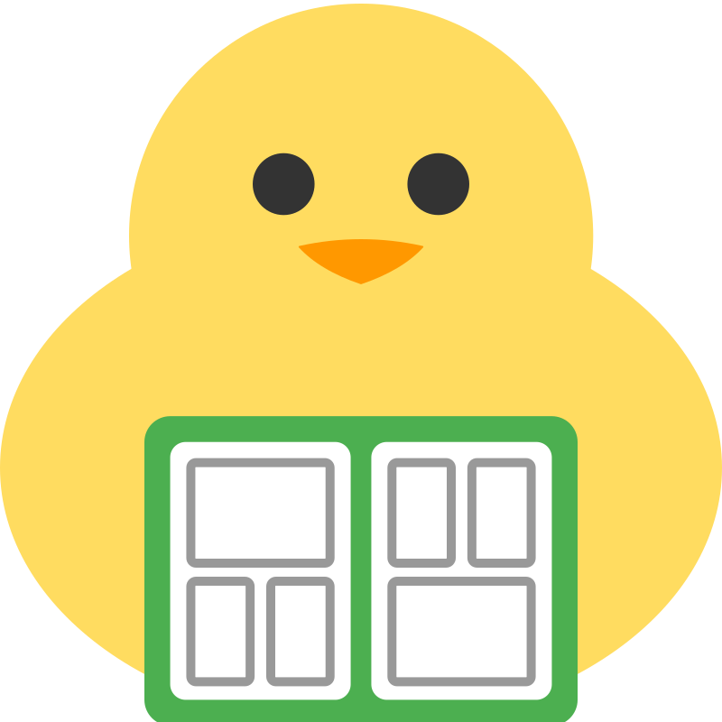
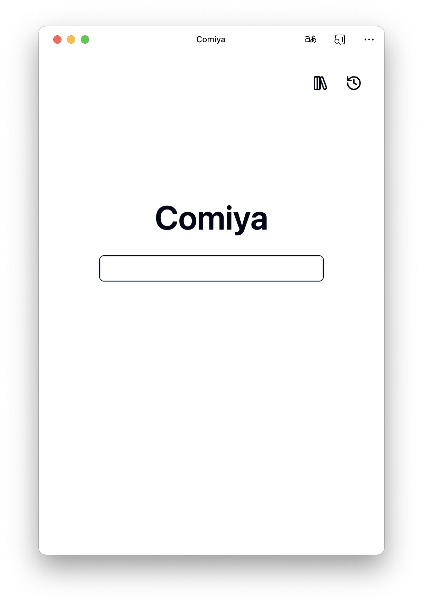

<p align="center">
  
</p>

# Comiya

A simple self-hosted comic site **only for learning purpose**.

Built with Vue.js, Axum and SeaORM. Available in PWA.

  

## Usage

### Docker Compose

```yml
services:
  comiya:
    image: mapoos/comiya:latest
    container_name: comiya
    restart: unless-stopped
    environment:
      - PASSWORD=xxx # optional
    volumes:
      - ./data:/comiya/data
    ports:
      - 8000:8000
```
